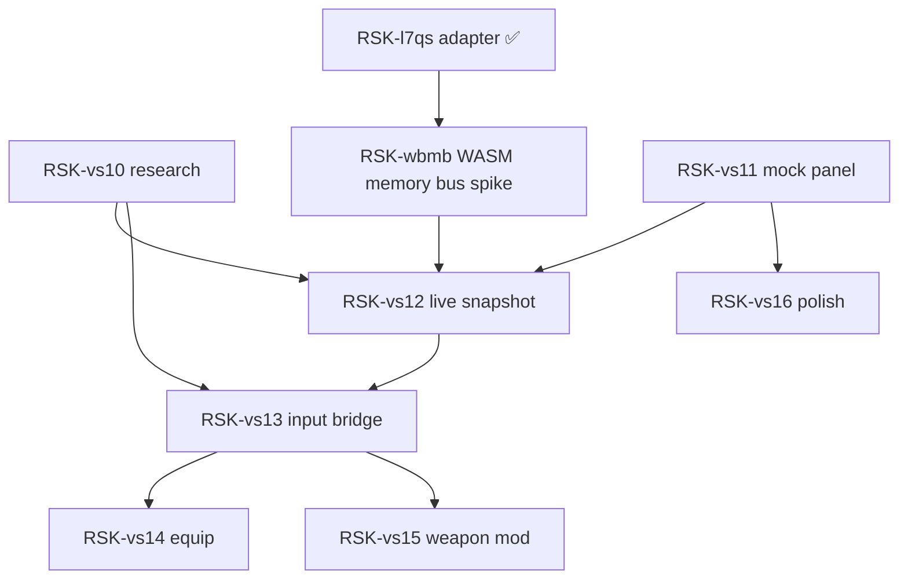

---
# RSK-uxvs
title: 'Epic: Vagrant Story — modern in-game UI + emulator bridge'
status: in-progress
type: epic
priority: normal
created_at: 2026-03-22T15:00:00Z
updated_at: 2026-03-22T16:00:00Z
---

## Context

**Program:** Phase 1 foundation (**RSK-9c07**) is complete. **Playable 03** and follow-on work are **not** Harness scaffolding — they target **real play + remaster UX** for **Vagrant Story**, and live under **this** epic instead of **RSK-9c07**.

**Product direction (incremental):** Replace parts of the **native PS1 UI** (starting with **Triangle → Item** flows) with a **modern web UI** that supports **mouse and touch**, so players avoid **Triangle → deep sub-menus → action** for common tasks (use item, equip, weapon modify, …). Ship **one menu surface at a time**: first the **first screen** that appears when Triangle is pressed, while **still invoking existing sub-menus** as-is where not yet replaced; then expand.

**Technical stack:** Existing **plugin model**, **mock** vertical slice, **PlayStation bundle** (**RSK-v50c**), and **`RiskbreakerEmulatorHost`** bridge (**RSK-7lri**) — extend with **emulator-backed runtime** and decoders feeding web panels.

## Goal

1. **Runtime seam:** **`EmulatorRuntimeAdapter`** implementing **`IRuntime`**, alongside **`MockRuntimeAdapter`**, so **`SessionOrchestrator`** can run **`mock` | `emulator`** sessions — [**RSK-l7qs**](./RSK-l7qs--playable-03-iruntime-emulator-adapter.md).
2. **UX remaster (phased):** Incremental **Riskbreaker** surfaces for Triangle-driven flows, grounded in **decoder/state** and **RSK-vs10** research — no coupling from `playstation-src/` to `plugins/*`.

## Children (full roadmap)

| Order | Bean | Summary |
|------:|------|---------|
| 1 | [**RSK-l7qs**](./RSK-l7qs--playable-03-iruntime-emulator-adapter.md) | Playable 03 — `IRuntime` / **EmulatorRuntimeAdapter** vs **MockRuntimeAdapter** — **done** |
| 2 | [**RSK-vs10**](./RSK-vs10--vs-menu-research-ram-feasibility.md) | Menu topology + RAM / feasibility **research doc** — **done** ([`docs/vagrant-story-menu-research.md`](../../docs/vagrant-story-menu-research.md)) |
| 2.5 | [**RSK-wbmb**](./RSK-wbmb--spike-pcsx-wasm-memory-bus-to-iruntime-bridge.md) | **Spike: WASM memory bus → `IRuntime` bridge** — postMessage peek/poke; unblocks vs12–vs15 |
| 3 | [**RSK-vs11**](./RSK-vs11--vs-parallel-triangle-first-screen-mock-ui.md) | **Parallel first Triangle screen** — web panel, **mock** data, touch + mouse |
| 4 | [**RSK-vs12**](./RSK-vs12--vs-emulator-snapshot-decoder-pipeline.md) | **Emulator → decoder → view model** (inventory-first live path) — **needs RSK-wbmb** |
| 5 | [**RSK-vs13**](./RSK-vs13--vs-input-bridge-web-to-game.md) | **Input bridge** — one web action → game (minimal scope) |
| 6 | [**RSK-vs14**](./RSK-vs14--vs-equip-surface-modern-ui.md) | **Equip** surface — incremental replacement |
| 7 | [**RSK-vs15**](./RSK-vs15--vs-weapon-modify-surface-modern-ui.md) | **Weapon modify** surface — incremental replacement |
| 8 | [**RSK-vs16**](./RSK-vs16--vs-hybrid-native-visibility-a11y.md) | **Hybrid native UI**, **a11y**, **intl** polish |

## Dependency graph (logical)

- **RSK-vs11** can start on **mock** path immediately; **RSK-vs12** needs **RSK-wbmb** (WASM memory bus spike).
- **RSK-vs14** / **RSK-vs15** may **overlap** in planning but should stay **sequential** in delivery to limit risk.

## Related work (sibling epics / tasks)

| Id | Relation |
|----|----------|
| **RSK-v50c** | PlayStation bundle + overlay foundation |
| **RSK-7lri** | Emulator **host** interface (`RiskbreakerEmulatorHost`) |
| **RSK-l7qt** | Done — lrusso/PlayStation migration |
| **RSK-xfc8** | Epic: **dev telemetry**, perf **HUD**, Riskbreaker **menu** toggles (children **RSK-n8wk**, **RSK-p4jm**) |
| **RSK-74eh** | Backtick overlay — coordinate **focus** with **RSK-vs16** |

## Links

- Parent program context: **RSK-9c07** (closed); Phase 2 continues here.
- Task index: [docs/README.md](../../docs/README.md)
- Starting **usable** items: [docs/vagrant-story-inventory-reference.md](../../docs/vagrant-story-inventory-reference.md)
- Starting **equipment** loadout: [docs/vagrant-story-equipment-reference.md](../../docs/vagrant-story-equipment-reference.md)
- Menu topology & feasibility: [docs/vagrant-story-menu-research.md](../../docs/vagrant-story-menu-research.md)
- GameFAQs detail + **agent-browser** verification: [docs/vagrant-story-menu-verification-playbook.md](../../docs/vagrant-story-menu-verification-playbook.md)
