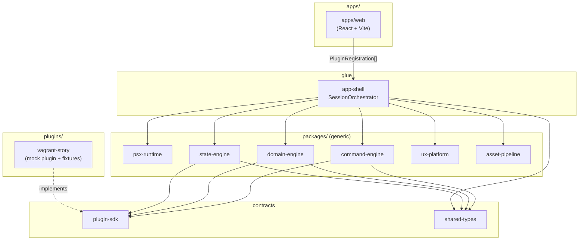
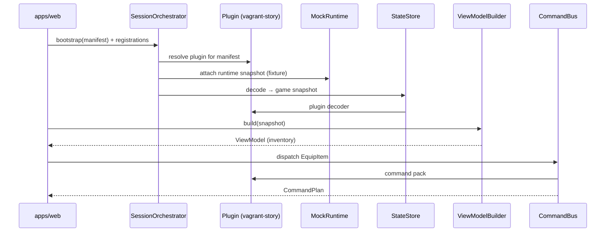

# Riskbreaker — architecture

This document summarizes **package boundaries**, the **plugin model**, **data flow** for the mocked vertical slice, and **dependency rules**. It stays aligned with [`project-spec.md`](../project-spec.md) and [`.groove/memory/specs/psx-ux-remaster-harness.md`](../.groove/memory/specs/psx-ux-remaster-harness.md).

---

## Layers (core / glue / game)

| Layer             | Where it lives                                    | Rule                                                                     |
| ----------------- | ------------------------------------------------- | ------------------------------------------------------------------------ |
| **Core**          | `packages/*` (generic engines, SDK, shared types) | Reusable across games; **no game-specific logic**.                       |
| **Glue**          | `packages/app-shell`, `packages/asset-pipeline`   | Wires plugins to engines; **does not import** concrete plugins.          |
| **Game-specific** | `plugins/*` only                                  | Manifest handling, decoders, domain/command packs, fixtures for a title. |

Game-specific code **must not** leak into generic packages ([`project-spec.md`](../project-spec.md) — Architectural rules).

---

## Dependency rules

**Allowed direction** (from [`project-spec.md`](../project-spec.md)):

- **Apps** → **packages** → `plugin-sdk` / `shared-*`
- **Plugins** → `plugin-sdk`, `shared-*`, and **generic** packages (via interfaces)
- **Generic packages must not depend on plugins** (no imports from `plugins/*`)

**UI boundary:** the web app consumes **view models** and **command intents** — not raw emulator memory.

**Runtime boundary:** `psx-runtime` exposes contracts and mocks; real emulator integration is a later seam.

---

## Package map (abbreviated)

| Path                      | Role                                                             |
| ------------------------- | ---------------------------------------------------------------- |
| `packages/shared-types`   | Domain types (`GameManifest`, snapshots, commands, view models). |
| `packages/shared-utils`   | Generic helpers.                                                 |
| `packages/plugin-sdk`     | Plugin contracts and registration shapes.                        |
| `packages/psx-runtime`    | `IRuntime` + mock adapter.                                       |
| `packages/asset-pipeline` | Manifest parsing / building.                                     |
| `packages/state-engine`   | `StateStore`; uses **plugin-provided decoders**.                 |
| `packages/domain-engine`  | `ViewModelBuilder`; plugin domain packs.                         |
| `packages/command-engine` | `CommandBus`; plugin command packs.                              |
| `packages/ux-platform`    | Screen registry / input placeholders.                            |
| `packages/save-service`   | Save slot browsing seam.                                         |
| `packages/devtools`       | Timeline / logging hooks.                                        |
| `packages/app-shell`      | `SessionOrchestrator`, plugin resolution, **`ActiveSession`**.   |
| `plugins/vagrant-story`   | Mock **Vagrant Story** plugin + fixtures.                        |
| `apps/web`                | React UI; passes **plugin registrations** into the orchestrator. |

Each package has a short [`README.md`](../packages/) at its root; this file is the cross-cutting view.

---

## Plugin model

1. A **plugin** implements `plugin-sdk` contracts (metadata, `canHandle(manifest)`, decoders, domain/command/UI registrations).
2. **`app-shell`** resolves which plugin owns the current manifest and builds an **`ActiveSession`**: runtime, state store, view-model builder, command bus, screen registry, etc.
3. **Apps and tests** supply **`PluginRegistration[]`** (e.g. `createVagrantStoryPlugin`) — the shell never hardcodes a game name.

---

## Mock vertical slice (data flow)

End-to-end path for the Phase 1 harness (see [`project-spec.md`](../project-spec.md) — Example development flow):

1. Load a **fixture manifest** (Vagrant Story mock).
2. **Plugin registry** selects the `vagrant-story` plugin.
3. **Mock runtime** starts from a **fixture runtime snapshot**.
4. **State engine** reads snapshot → plugin **decoder** → normalized **game snapshot**.
5. **Domain engine** builds an **inventory view model**.
6. **UI** renders inventory (mock).
7. User triggers **EquipItem** → **command engine** returns a **command plan** (fixture-backed).

Integration coverage: [`tests/pipeline.integration.test.ts`](../tests/pipeline.integration.test.ts). Browser flow: **`pnpm dev`** → **Load mock session** in [`apps/web`](../apps/web).

---

## Diagram — components (Mermaid)

**Edges:** `apps/web` only passes registrations; **generic packages do not import** `plugins/vagrant-story`.

---

## Diagram — bootstrap sequence (Mermaid)

---

## Playable emulator spike (not integrated yet)

A **browser PS1 emulator** proof-of-concept lives at **`/play/spike`** in [`apps/web`](../apps/web) using a vendored legacy PS1 emulator bundle (WASM lineage). It is **not** connected to `SessionOrchestrator` or `psx-runtime` yet — see [`playable-emulator-spike.md`](./playable-emulator-spike.md).

### PCSX-wasm artifact integration contract

This spike uses a browser-ready PCSX-wasm fork (kxkx5150 / first-party under `packages/`). The integration contract is:

1. **Build inputs and source of truth live in `packages/pcsx-wasm-core/`**
2. **Runtime artifacts are materialized into `packages/pcsx-wasm-core/dist/`** by `scripts/ensure-pcsx-wasm.mjs`
3. **The web app consumes runtime artifacts only via `apps/web/public/pcsx-wasm/`**
   - `scripts/sync-pcsx-wasm-public.mjs` copies from `packages/pcsx-wasm-core/dist/` into `apps/web/public/pcsx-wasm/`
4. `apps/web` and Playwright both run the preflight `ensure:pcsx-wasm` before starting Vite / the dev server.

---

## Related links

- [`project-spec.md`](../project-spec.md) — authoritative spec and non-goals for this phase.
- [`.groove/memory/specs/psx-ux-remaster-harness.md`](../.groove/memory/specs/psx-ux-remaster-harness.md) — harness naming, ordering, decisions.
- [`README.md`](../README.md) — setup, scripts, infra, Netlify.
- [`apps/docs/README.md`](../apps/docs/README.md) — optional Vite doc placeholder (`pnpm dev:docs`).
