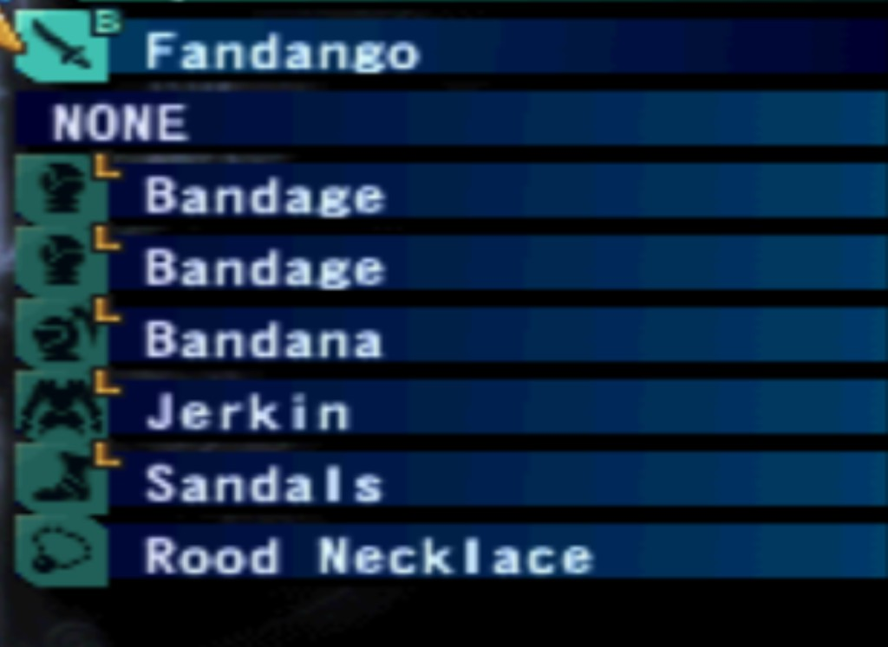

# Vagrant Story — equipment reference (starting loadout)

Reference for **RSK-uxvs** / **RSK-vs14** (Equip surface): what the native **equipment** screen shows at **game start** — **per-slot** names and material hints for mock fixtures, parity checks, and modern UI.

Screenshot (native PS1 UI, equipment list):

## Starting equipment (new game)

Rows are **top to bottom** as in-game. **Letter** = small material / class badge on the row (e.g. **B** blade, **L** leather) where shown.

| Slot        | Letter | Equipped item   |
| ----------- | :----: | --------------- |
| Weapon      |   B    | Fandango        |
| Off-hand    |   —    | NONE            |
| Right arm   |   L    | Bandage         |
| Left arm    |   L    | Bandage         |
| Head        |   L    | Bandana         |
| Body        |   L    | Jerkin          |
| Leg         |   L    | Sandals         |
| Accessory   |   —    | Rood Necklace   |

## UI notes (for replacement UX)

- **Layout:** one row per **slot**; icon in a **teal** square, letter badge where applicable, **name** on the right; dark blue bars; selection = **yellow arrow** + highlight on active row.
- **Remaster target:** typed **slot** + **display name** + optional **material/category**; off-hand can be **empty** (`NONE`).

## Links

- Menu topology & RAM notes: [vagrant-story-menu-research.md](./vagrant-story-menu-research.md)
- Usable items (consumables list): [vagrant-story-inventory-reference.md](./vagrant-story-inventory-reference.md)
- Epic: `.groove/tasks/RSK-uxvs--epic-vagrant-story-ui-remaster-and-emulator-bridge.md`
- Equip surface bean: **RSK-vs14**
