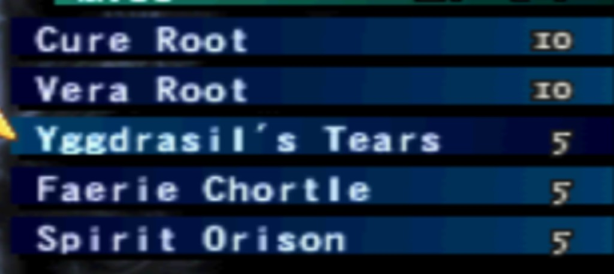

# Vagrant Story — inventory reference (starting usable items)

Reference for **RSK-uxvs** (modern Item / Triangle flows): what the native **Items** list shows at **game start** for **usable** entries — **names + quantities** for mock fixtures, parity checks, and UI spikes (**RSK-vs11** onward).

Screenshot (native PS1 UI, Item sub-menu list):

## Starting usable items (new game)

| Item name           | Qty |
| ------------------- | --: |
| Cure Root           |  10 |
| Vera Root           |  10 |
| Yggdrasil's Tears   |   5 |
| Faerie Chortle      |   5 |
| Spirit Orison       |   5 |

## UI notes (for replacement UX)

- **Layout:** vertical list; one row per item; **name** left, **quantity** right; dark blue row chrome; selection = lighter bar + **yellow arrow** cursor on the left.
- **Remaster target:** same data model at minimum (**display name** + **stack count**); modern UI can use **larger hit targets**, grid/icons, touch — see epic **RSK-uxvs**.

## Links

- Epic: `.groove/tasks/RSK-uxvs--epic-vagrant-story-ui-remaster-and-emulator-bridge.md`
- Menu topology & RAM notes: [vagrant-story-menu-research.md](./vagrant-story-menu-research.md) (**RSK-vs10**)
- Starting **equipment** (per-slot loadout): [vagrant-story-equipment-reference.md](./vagrant-story-equipment-reference.md)
