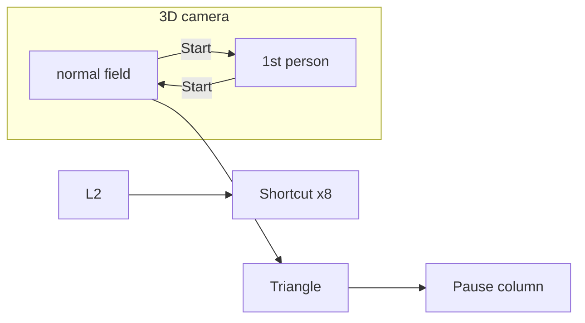
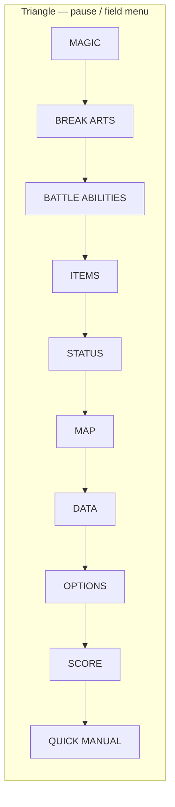

# Vagrant Story (PS1) — field menu map & navigation model

**Purpose:** One place for **how native menus are organized** and **how they relate to Riskbreaker** (mock UI, emulator verification). This is **not** a RAM map (**RSK-vs12**) and **not** a copy of third-party FAQ prose (copyright).

**Primary source (human):** [GameFAQs — Miscellaneous Guide](https://gamefaqs.gamespot.com/ps/914326-vagrant-story/faqs/8331) (Dan_GC, US PSX focus) — read **§2.4 Menu** and the guide **TOC** for exact wording and edge cases.

**Companion:** [vagrant-story-menu-verification-playbook.md](./vagrant-story-menu-verification-playbook.md) (shell URLs, keyboard mapping, `.bin` load, **Start → 3D → Triangle** habit).

**Status (playbook execution → “full map”):** The **complete entry tree** and **navigation model** (Triangle column vs **L2** vs **workshops**; intro / **3D** / **1st person**; **ITEMS** subtree) are captured in **§0–§4** below, sourced from the FAQ **TOC** / **§2.4** (paraphrase). **Automated** ROM runs (**§6**) confirm **when Triangle does not apply** (intro, **1st person**) and the **Start**-mash / camera pitfalls; they do **not** replace reading **§2.4** for exact sub-screen copy or **RSK-vs12** for runtime menu IDs.

---

## 0. How menus work (behavioral model)

This section is the **mental model** you need for remaster UX and for **playbook** runs. Detail names match the FAQ **TOC** / **§2.4**; we do not reproduce the guide’s prose.

### 0.1 Three different UI systems (do not conflate)

| System | Opens with | Purpose |
| ------ | ----------- | -------- |
| **Triangle pause column** | **Triangle** (`D`) in **3D** with **normal field camera** | Main hub: **MAGIC → … → QUICK MANUAL** (§2). |
| **L2 shortcut menu** | **L2** (`E`) in **Normal / Battle** | **Eight** quick slots (items, chains, magic, … per FAQ). |
| **Workshops** | Entering workshop locations in the **world** | Combine / tables / assembly — **not** the same screen as the pause column (linked via **ITEMS** / economy). |

### 0.2 Game state vs which menu is relevant

| Phase | Triangle pause stack | Notes |
| ----- | --------------------- | ----- |
| **Intro — logos, quotes, FMV, 2D placards** | **Not** the verification target | Advance with **Start** (`V`) until **3D** gameplay. |
| **3D, normal camera** | **Yes** — full column | **L1/R1** switch sub-menus inside the stack (FAQ); **STATUS** uses **character** switching where applicable. |
| **3D, 1st person** | **No** (Triangle does not open this stack) | **Start** in **3D** toggles **1st person**; leave that mode first (often **Start** again). |
| **Combat** | **Yes** (when FAQ allows same stack) | **L2** shortcuts are especially relevant here. |



### 0.3 Single-tree outline (Triangle pause — full map)

Use this as the **authoritative vocabulary** list for UI replacement (confirm exact sub-screens in FAQ **§2.4**).

```text
Triangle (field pause)
├── MAGIC
├── BREAK ARTS
├── BATTLE ABILITIES
├── ITEMS
│   ├── Inventory class lists (e.g. WEAPONS, BLADES, … MISC — full set in FAQ)
│   └── Item-flow OPTIONS: EQUIP, SETUP, workshop-style actions (repair/combine/…)
├── STATUS          ← L1/R1: FAQ notes character switching here
├── MAP             ← distinct from HUD minimap
├── DATA
├── OPTIONS         ← game options (text speed, etc.) — name collision with ITEMS sub-flow “options”
├── SCORE
└── QUICK MANUAL    ← FAQ subsections A–N (controls, risk, magic, equipment, …)
```

**Parallel (not under Triangle):** **L2** shortcut ring; **world workshops**.

---

## 1. When this menu exists (game state)

| State | Triangle (`/\`) — field / pause stack |
| ----- | -------------------------------------- |
| **3D gameplay, normal field camera** (third-person style control; exploration / combat) | Opens the **right-hand pause column** (see §2). |
| **3D, 1st person view** (entered with **Start** while in **3D**) | **Triangle does not** open that field menu — leave **1st person** first (often **Start** toggles the camera back). |
| **FMV, 2D scenes, “NOW LOADING…”, title / attract** | **Not** the field menu you want for ITEMS/STATUS parity work — mash **Start** only to reach **3D**, then **avoid extra Start** so you do not sit in **1st person** when testing **Triangle**. |

**Emulator shell keyboard:** Triangle → **`D`**, Start → **`V`**. **Canvas must be focused** or pad events never reach the core; our Playwright script **re-clicks the emulator canvas immediately before** sending **`D`** ([`scripts/verify-vagrant-story-rom.mjs`](../scripts/verify-vagrant-story-rom.mjs)).

**Automation caveat:** A long **Start** smash **after** load can overlap real **3D** and trap the session in **1st person**, so **Triangle** looks broken — shorten or disable post-boot Start mashing when capturing menu shots (see [playbook §3.6](./vagrant-story-menu-verification-playbook.md#36-vagrant-story-usa--start-through-intros-triangle-only-when-not-in-1st-person)).

---

## 2. Full map — Triangle pause menu (top-level column)

The FAQ’s **TOC** and **§2.4** describe a **vertical stack on the right**, top to bottom. Names below match **on-screen vocabulary** players expect in a remaster.



| # | Entry | Role (summary) |
| - | ----- | ---------------- |
| 1 | **MAGIC** | Spell lists / casting context (see FAQ for sub-screens). |
| 2 | **BREAK ARTS** | Weapon special attacks tied to affinity / usage. |
| 3 | **BATTLE ABILITIES** | Combat techniques (chains, defenses, etc. — FAQ detail). |
| 4 | **ITEMS** | Inventory + item-related actions — **largest subtree** (§3). |
| 5 | **STATUS** | Character / body / stats; **L1/R1** behaviour includes **character switching** where applicable (FAQ). |
| 6 | **MAP** | Area map / navigation aid (distinct from corner **minimap** HUD). |
| 7 | **DATA** | Reference / log-style screens (FAQ). |
| 8 | **OPTIONS** | **Game options** (e.g. text speed, speaker icons — **not** the word “OPTIONS” inside **ITEMS**). |
| 9 | **SCORE** | Scoring / ranking display (FAQ). |
| 10 | **QUICK MANUAL** | In-game manual; FAQ lists **subsections A–N** (controls, risk, magic, equipment, maps, …). |

**L1 / R1:** FAQ documents **switching menus** inside the pause stack; **STATUS** is called out for **character** switching — use the FAQ for exact button semantics.

---

## 3. ITEMS subtree (high level — FAQ §2.4)

Paraphrase of our playbook ([§1.2](./vagrant-story-menu-verification-playbook.md#12-section-24-menu--what-the-guide-says-happens-when-you-open-the-menu)):

- **ITEMS** leads to **further panels**: inventory **class lists** (guide enumerates headings such as **WEAPONS**, **BLADES**, through **MISC** — exact set and order in FAQ).
- A branch described as **OPTIONS** *inside the item flow* exposes **EQUIP**, **SETUP**, and **workshop-style** actions (repair / combine / assembly — tied to equipment and crafting loops).
- **Workshop** rooms in the **world** are a **separate** UX surface from this pause column (same save/inventory ecosystem; see FAQ **Workshops** sections).

**In-repo parity fixtures (starting state only):**

- Usable item list + list UI notes: [vagrant-story-inventory-reference.md](./vagrant-story-inventory-reference.md)
- Equip slots + row chrome: [vagrant-story-equipment-reference.md](./vagrant-story-equipment-reference.md)

---

## 4. L2 shortcut menu (outside the pause column)

From the same FAQ (controls section; summarised in [playbook §1.3](./vagrant-story-menu-verification-playbook.md#13-controls-elsewhere-in-the-same-guide-cross-reference)):

- In **Normal / Battle** mode, **L2** opens a **shortcut menu** (not the same layout as the Triangle stack).
- **Eight shortcut slots** tie to areas such as **MISC** items, **defense / chain** abilities, **magic**, etc. (exact mapping in FAQ).
- **Shell:** L2 → **`E`** in the emulator shell keyboard table.

Treat **Triangle stack** vs **L2 shortcuts** as **two different** navigation trees for remaster IA.

---

## 5. Mock plugin vs native top-level (expectation management)

The mock UI pack (`plugins/vagrant-story`) exposes coarse **`screenIds`**: `inventory`, `equipment`, `map`, `status`, `system`. That is **not** a 1:1 list with the **ten** native pause entries — it is a **harness** shape until **RSK-vs12** maps live RAM / scene IDs.

---

## 6. Emulator playbook — execution log (automation)

| Run | What we proved |
| --- | ---------------- |
| **2026-03-22 (long)** (`verify-vagrant-story-rom.mjs`, local Vite, NTSC-U `.bin`) | **ROM load** + long **Start** duration + boot **poll** (frame heartbeat) can reach **3D** (dungeon, **HP/MP/RISK**, HUD — `vagrant-story-real-before-triangle.png`). **Triangle** did not show the pause column when **1st person** or **focus** issues applied; see §1 / §0.2. |
| **2026-03-22 (short mash)** | **`VAGRANT_STORY_START_MASHES=60`**, **150 s** boot: session **still in intro** (e.g. opening quote / manor FMV). **Triangle** is **irrelevant** here — not **3D** field yet. Confirms automation must use **much larger** intro skip (duration **or** count) until HUD/minimap appear, **then** **stop** Start mashing before **Triangle** (§3.6). |
| **2026-03-22 (long mash, no toggle)** | **120 s** boot + **90 s** Start duration: **3D** dungeon, **1st-person** barrel corridor; **Triangle** did **not** show the pause column (matches §1 — field menu not in **1st person**). |
| **2026-03-22 (`TOGGLE_CAMERA_BEFORE_TRIANGLE=1`)** | One extra **`v`** before screenshots: still **not** a reliable way to land on **third-person** + menu — a single **Start** **toggles** camera; if the session was **already** third-person, this **`v`** can **enter** **1st person** instead. **Human** camera check remains the reliable fix. |
| **Canvas refocus before `D`** | Helps input routing; does not replace “must be in **3D** with **normal field camera** (not **1st person**).” |

**What “understanding the menu” means in-repo:** the **full map** of **entries and relationships** is **§0.3 + §2–§4** (FAQ-sourced structure). **Pixel** confirmation of each submenu requires either **human** play or **much longer** scripted intro skip + **not** mashing Start after **3D** (1st-person trap). **Semantic** “which panel is open” in the browser remains **RSK-vs12** / instrumentation (§7).

**Limits:** Headless timing still may miss the menu (load variance, **camera mode**, battle state, or input routing). **Human** verification on the same URL + ROM remains authoritative for pixel-level menu chrome.

---

## 7. “Events” in the browser (expectations)

| Layer | What you can know today |
| ----- | ------------------------ |
| **DOM** | Shell controls only — **not** which FAQ submenu is open. |
| **Canvas** | **Screenshots** / diffs — menu chrome vs 3D HUD. |
| **Semantic menu id** | **Unknown** until instrumentation (**RSK-vs12** / **RSK-xfc8**). |

---

## 8. Links

- Verification steps: [vagrant-story-menu-verification-playbook.md](./vagrant-story-menu-verification-playbook.md)
- Topology + RAM gaps: [vagrant-story-menu-research.md](./vagrant-story-menu-research.md)
- ROM automation: [`scripts/verify-vagrant-story-rom.mjs`](../scripts/verify-vagrant-story-rom.mjs)
