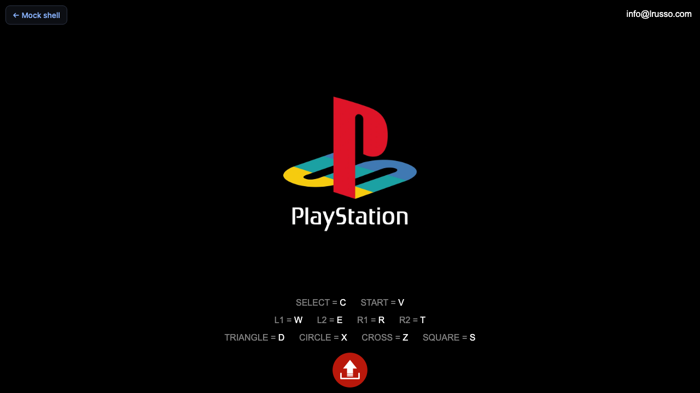

# Vagrant Story — menu guide detail & verification playbook (2026)

This doc ties together **what the classic GameFAQs guide actually contains** (structure only — do not mirror the full text in-repo), **2026 access reality**, and how to verify **controls / UI** in the **PCSX-wasm browser shell** (“**if I press Triangle, what happens**”: **visually** + **instrumentation**).

**GameFAQs:** open the FAQ in a **normal browser** — no automation needed.

**`agent-browser`:** best used to exercise the **emulator page itself** (same document the player gets), not GameFAQs:

| Environment | URL |
| ----------- | --- |
| **Local dev** (Vite) | `http://localhost:5173/pcsx-wasm/index.html?riskbreaker=1` |
| **Deployed** (example) | `https://riskbreaker.netlify.app/pcsx-wasm/index.html?riskbreaker=1` (or site root `/` → redirect) |

## 1. Primary written source — GameFAQs “Miscellaneous Guide”

| Field | Value |
| ----- | ----- |
| **URL** | [Vagrant Story (PS) — FAQ / Miscellaneous Guide](https://gamefaqs.gamespot.com/ps/914326-vagrant-story/faqs/8331) |
| **Author** | Dan_GC (GameFAQs community) |
| **Guide meta** | Version **0.1**, last updated **2000-07-22** (US / PSX era) |
| **Scope** | Broad: controls, screen layout, **full menu breakdown**, workshops, magic lists, items, areas — not only menus |

### 1.1 What the Table of Contents gives you (high level)

The guide’s own TOC (section **2. Introduction → 4. Menu**) lists the **right-hand menu stack** and nested topics, including:

- **MAGIC**, **BREAK ARTS**, **BATTLE ABILITIES**, **ITEMS**, **STATUS**, **MAP**, **DATA**, **OPTIONS**, **SCORE**, **QUICK MANUAL**
- Under **QUICK MANUAL**, subsections **A–N** (controls, modes, status, damage, risk, magic, chains, defense, break arts, puzzles, arms/armor, maps, readme)
- **Workshops** (combining, tables, etc.) — separate from the pause menu but relevant to **ITEMS → equipment / assembly** flows

**Riskbreaker use:** treat this as the **authoritative menu vocabulary** for UX replacement (what players expect to see named on-screen), not as RAM addresses.

### 1.2 Section “2.4 Menu” — what the guide says happens when you open the menu

Paraphrase only (see FAQ for exact wording):

- The **menu screen** is opened with the **/\ (Triangle)** button.
- A **column on the right** lists the top-level entries: **MAGIC** through **QUICK MANUAL** (as enumerated in the TOC).
- Each entry leads to **further panels** described in the same section — e.g. **ITEMS** expands into **OPTIONS** (with **EQUIP**, **SETUP** and workshop-style actions), and inventory class lists (**WEAPONS**, **BLADES**, … **MISC**).

This matches the **incremental remaster** idea: replace **one** panel first (e.g. first **ITEMS** list you care about), leave deeper **SETUP / workshop** trees on native UI until **RSK-vs14+**.

### 1.3 Controls elsewhere in the same guide (cross-reference)

The guide also documents (among other things):

- **/\** — open menu (and context-dependent exits)
- **L1 / R1** — switch menus (with a note about **character** switching in **STATUS**)
- **Shortcut menu** via **L2** in Normal/Battle mode, and **eight shortcut slots** tied to menu areas (MISC items, defense/chain abilities, magic, etc.)

Use the FAQ for **exact** button lists; this playbook does not duplicate them.

---

## 2. 2026 — reading GameFAQs in practice

| Issue | Implication |
| ----- | ----------- |
| **Bot / DDoS protection** | Automated browsers (e.g. **`agent-browser`**, Playwright) often stall on **“Just a moment…”** (Cloudflare-style challenge). **Do not assume** headless fetch works for everyone. |
| **Layout / ads** | DOM structure differs from 2000 HTML; content is still there but surrounded by site chrome. |
| **Stale regions** | Guide targets **US PSX**; other builds may differ slightly. |
| **Copyright** | The FAQ is **third-party prose**. Link to it; **do not paste** multi-paragraph excerpts into our repo. Paraphrase mechanics at a high level only. |

**Practical approach:** bookmark the FAQ and read it like any other page. Take **your own notes** or screenshots locally if useful — no automation required.

---

## 3. `agent-browser` — emulator page (recommended use)

Install/use the CLI per [`.agents/skills/agent-browser/SKILL.md`](../.agents/skills/agent-browser/SKILL.md).

Open the **full-page shell** directly (same as [playable-emulator-spike.md](./playable-emulator-spike.md) after redirect):

**Local**

```bash
pnpm dev   # repo root; Vite on http://localhost:5173

agent-browser open "http://localhost:5173/pcsx-wasm/index.html?riskbreaker=1"
agent-browser wait --load networkidle
agent-browser wait 2000
agent-browser snapshot -i
agent-browser screenshot playstation-local.png
```

**Production (deployed build)**

```bash
agent-browser open "https://riskbreaker.netlify.app/pcsx-wasm/index.html?riskbreaker=1"
agent-browser wait --load networkidle
agent-browser snapshot -i
```

**Alternate entry:** [`/play/spike`](http://localhost:5173/play/spike) **redirects** to **`/pcsx-wasm/index.html?riskbreaker=1`** — fine for humans; for automation, open the static URL directly.

After load: **GitHub** link, **`#iso_opener`** (hidden file input), Riskbreaker overlay when `riskbreaker=1`. Loading a disc pulls **PCSX** WASM — see [playable-emulator-spike.md](./playable-emulator-spike.md).

**Focus:** click the **page / canvas** so keyboard reaches the core. Without focus, keys do nothing.

### 3.1 Keyboard → PS1 face buttons (emulator shell)

The PCSX-wasm shell shows a **fixed mapping** (local or deployed):

| PS1 | Key |
| --- | --- |
| **Triangle** | **D** |
| Circle | X |
| Cross | Z |
| Square | S |
| SELECT | C |
| START | V |
| L1 | W |
| L2 | E |
| R1 | R |
| R2 | T |

So for **Triangle** in `agent-browser` (after focus on the game): `agent-browser press d` (or the CLI’s key syntax for **D**).

### 3.2 “Triangle” — visual + input

The PS1 **Triangle** button is **not** a DOM node — send **keyboard** events the SDL layer maps (see §3.1).

```bash
agent-browser click @e_canvas   # ref from snapshot: canvas#canvas
agent-browser press d           # Triangle — verify in-game (menu only when gameplay allows)
agent-browser screenshot after-triangle.png
```

**Visual pass:** compare screenshots before/after; you should see **menu chrome** when the game state allows the menu to open.

### 3.3 “Events” — what the browser can know

| Layer | What you get |
| ----- | ------------- |
| **DOM** | **`click`**, **`keydown`** on `window` — **not** the game’s internal “menu opened” flag. |
| **Canvas** | Pixels change — **screenshot diff** or manual inspection. |
| **Emulator / WASM** | **Not** exposed to Riskbreaker unless we **instrument** (`packages/pcsx-wasm-shell`, **RSK-xfc8** telemetry, `performance.mark`, custom hooks on the worker / `Module`). |

So: **“if I press Triangle”** is **visually** verifiable immediately; **semantically** (“which submenu”) needs either **human labeling** or **future** RAM/menu-id instrumentation (**RSK-vs12**).

**Recommended habit:**

- Save **`screenshot` pairs** (`before-triangle.png`, `after-triangle.png`) per build.
- Optionally add **`performance.mark('riskbreaker:menu-open')`** in our bundle when we *detect* menu state (future work — not in core PCSX without hooks).

### 3.4 Recorded smoke test (`agent-browser`, 2026-03-22)

Commands were run with **Vite already on :5173** and **`agent-browser` 0.13.x**.

| Step | Result |
| ---- | ------ |
| Open **local** `…/pcsx-wasm/index.html?riskbreaker=1` | Document title **PlayStation**; full-page screenshot shows key legend (**TRIANGLE** SVG), **GitHub** link, upload control. |
| Open **Netlify** `…/pcsx-wasm/index.html?riskbreaker=1` | Same static shell (or `/` → redirect). |
| `snapshot -i` | **Canvas** may not be exposed as a named a11y control; use **click-to-focus** on the page or **screenshot** for visual QA. |
| `press d` (Triangle) **before** any `.bin` loaded | No change vs boot — **expected** (no game; nothing to open a field menu on). |

Screenshots (repo, for regression comparison):

- 
- 
- 

**Next:** load a legal **`.bin`** (see §3.5 — **red button first**), then repeat **`press d`** in-game to capture **before/after** menu visuals.

### 3.5 Loading a `.bin` — click the **red** upload button first

In **`pcsx-wasm/index.html`**, the file input is **`#iso_opener`** (class **`gui_controls_file`**, often hidden). The visible control is **`.gui_upload`**: a **red** circular hit target (bottom area) with **`title="Load disc image"`**.

**Manual QA:** click the **red** button, then choose a `.bin` in the dialog.

**Automation:**

| Tool | Steps |
| ---- | ----- |
| **`browser-use`** | Run `browser-use state` and **`browser-use click <n>`** on the element whose label is **`Select game`** (example index **`7`** on Netlify — indices vary by build). This CLI build (**0.12.x**) does **not** expose an `upload` subcommand; attach the file with **Playwright** `page.setInputFiles('#gui_controls_file', '/path/to/game.bin')` after that click (or use your existing **@playwright/test** harness). |
| **Playwright** | `await page.locator('.gui_upload').click()` then `await page.setInputFiles('#iso_opener', path)` — matches the real wiring (label → file input). |

Recorded after **click +** `setInputFiles` with a tiny smoke `.bin` (invalid ROM data; useful only to prove the load path runs):

- 

### 3.6 Vagrant Story (USA) — **Start** through intros, **Triangle** only when **not** in **1st person**

For this title, **Triangle** opens the **field menu** from normal **3D exploration / combat** (third-person style control). During FMVs, 2D scenes, “NOW LOADING…”, or title/attract mode, **Triangle** does not behave like the in-game menu you want for verification.

**1st person (critical):** Once you are in **3D**, pressing **Start** (keyboard **V**) enters **1st person view**. In that camera mode, **Triangle does not open the field menu** (it is tied to the normal field / pause stack). So:

- Mash **Start** only to **skip intros** until you have **3D control** — then **stop** mashing **Start** for verification.
- If you hit **Start** again in **3D**, you may toggle into **1st person**; leave that mode first (often **Start** toggles back — confirm against the FAQ / manual), **then** press **Triangle** (**D**).

**Manual habit:**

1. Load the `.bin` (red button → file).
2. After boot, **mash Start** (keyboard **V**) for on the order of **1–2 minutes** only as needed to advance past publisher logos, title, and cutscenes until you are **in the 3D part** with direct control — **do not keep mashing Start** after that, or you will keep toggling **1st person** and **Triangle** will appear “broken.”
3. In **3D**, **not** in **1st person**, press **Triangle** (**D**) and compare screenshots before/after for menu chrome.

**Automation:** `scripts/verify-vagrant-story-rom.mjs` **polls** until the emulator is running (bounded polling; `pcsx-game-active` on `body` plus a visible `canvas#canvas`), then runs a **Start** smash **after** that. If that window overlaps **3D** gameplay, it can leave the session in **1st person**, so **Triangle** may do nothing. Prefer **shorter** `VAGRANT_STORY_START_MASH_DURATION_MS`, use **`VAGRANT_STORY_START_MASHES`** for a tight count, or **0** smash + manual intro skip, then re-run for **Triangle** only. Defaults: short **settle** (`VAGRANT_STORY_3D_SETTLE_MS`) → refocus canvas → **Triangle** → screenshots.

Optional **`VAGRANT_STORY_TOGGLE_CAMERA_BEFORE_TRIANGLE=1`:** sends one **`v`** after the settle wait (then refocuses) in case **Start**-mashing left you in **1st person**. **Danger:** if you are **already** in **normal field camera**, that **`v`** **enters** **1st person** — use only when you expect to need to **leave** 1st person (or verify manually).

---

## 4. Session log template (copy per QA pass)

```
Date:
Build / commit:
Environment: Chromium / Firefox / Safari — version:
GameFAQs section re-read: [ ] 2.4 Menu  [ ] Controls

Emulator URL tested:
[ ] http://localhost:5173/pcsx-wasm/index.html?riskbreaker=1
[ ] https://riskbreaker.netlify.app/pcsx-wasm/index.html?riskbreaker=1  (or `/` on prod)

[ ] Dev server up (if local)
[ ] .bin loaded (which file: ___ ) — optional for full WASM path
[ ] Canvas / page focused
[ ] Start mashed through intros until **3D** / controllable (keyboard **V** per §3.1); **not** still mashing Start in 3D (avoids **1st person** — §3.6)
[ ] **Not** in **1st person** (Start in 3D toggles it; Triangle menu won’t open there)

Triangle (/\) — default is **D** (field menu — §3.6; **not** in 1st person):
[ ] agent-browser press d (or manual D key)
Visual: menu appeared? [ ] Y [ ] N
Screenshot paths: ___ / ___

Notes:
```

---

## 5. Links

- **Full menu map (Triangle column, L2, ITEMS, state model):** [vagrant-story-menu-map.md](./vagrant-story-menu-map.md)
- Menu research + sourcing: [vagrant-story-menu-research.md](./vagrant-story-menu-research.md)
- Emulator spike: [playable-emulator-spike.md](./playable-emulator-spike.md)
- Runtime gaps: [emulator-runtime-gaps.md](./emulator-runtime-gaps.md)
- Epic: **RSK-uxvs** — beans **RSK-vs11** (mock UI), **RSK-vs12** (snapshot), **RSK-vs13** (input)
